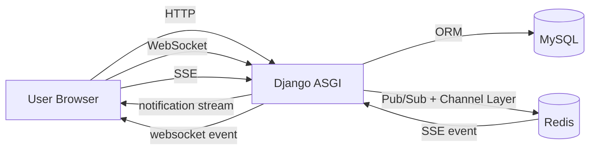
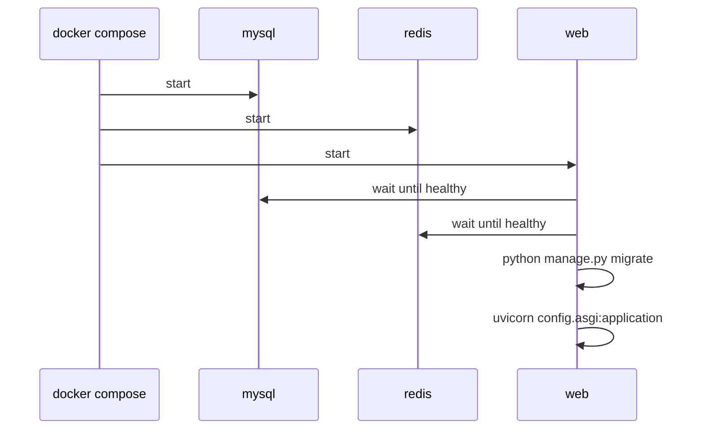

# Luồng Hoạt Động Tổng Quát

## 1. Kiến trúc runtime
- **Web**: Django ASGI (`uvicorn`) xử lý HTTP + WebSocket
- **MySQL**: dữ liệu nghiệp vụ
- **Redis**:
  - channel layer cho WebSocket
  - pub/sub cho SSE notifications

## 2. Sơ đồ tổng quan

## 3. Luồng request chuẩn
1. JWT middleware xác thực từ cookie `access/refresh`.
2. View gọi service xử lý nghiệp vụ.
3. Service ghi DB và phát event realtime khi cần.
4. UI nhận update qua WebSocket/SSE và render lại.

## 4. Luồng Docker startup

