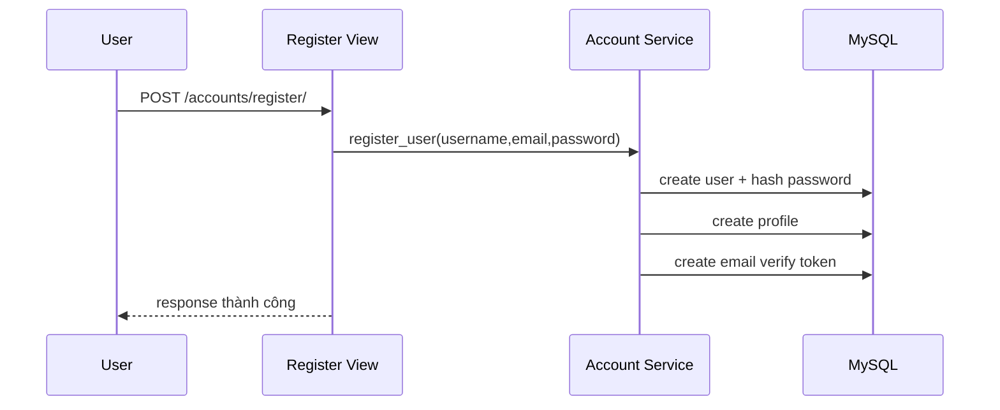
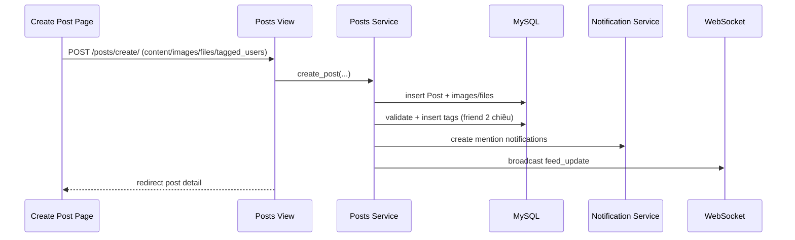
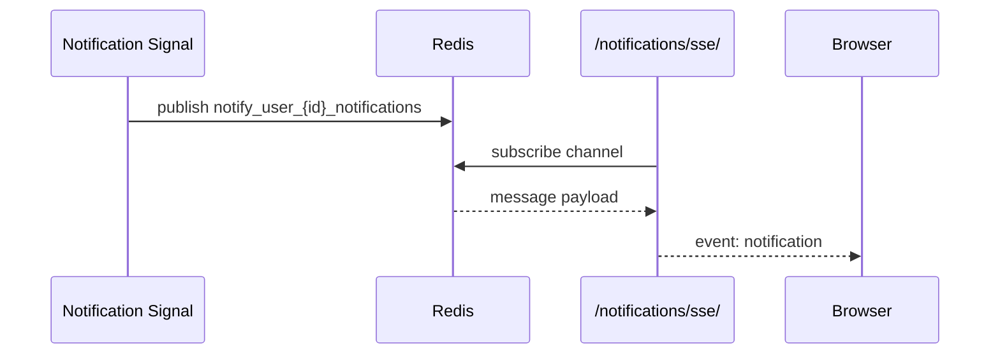

# Luồng Chi Tiết Từng Chức Năng

## 1. Register/Login/Password
### Register

### Login
1. Validate email/password.
2. Hỗ trợ migrate password legacy plain-text -> hash khi login đúng.
3. Tạo JWT pair (`access`, `refresh`) + lưu refresh token DB.
4. Set cookie và redirect về home.

### Refresh trong middleware (đã harden)
- Khi thiếu/expired `access` nhưng có `refresh` hợp lệ: tạo access mới **inline** và tiếp tục request hiện tại (không redirect làm mất POST).

## 2. Create Post + Tag + Media
### Luồng tạo post

### Rule validate
- Reject chỉ khi **đồng thời rỗng**: `content`, `images`, `files`.
- Cho phép:
  - text-only
  - media-only
  - text+media+tag

## 3. Reactions + Comments
- Reaction post/comment hỗ trợ: `like/love/haha/wow/sad/angry`.
- Luồng toggle:
  - chưa có -> add
  - cùng loại -> remove
  - khác loại -> change
- Có broadcast WebSocket event để UI cập nhật realtime.

## 4. Notifications (SSE + redirect)
### Trigger
- Post: react/comment/reply/share/mention
- Friend: friend_request/friend_accept
- Group: join_request/request_accept/post_in_group

### Luồng SSE

### Mở thông báo
- `GET /notifications/<id>/open/`
- Mark `is_seen=true`, `is_read=true`
- Redirect đúng `link` tài nguyên (có normalize an toàn)

## 5. Friends
- `send_friend_request` tạo notification cho recipient.
- `accept_friend_request` tạo quan hệ friend 2 chiều + notification trả về sender.

## 6. Groups
- User phải là member mới đăng được bài trong group.
- Member thường: post `pending`.
- Owner/Admin: post `approved`.
- Tạo notification cho owner khi có bài mới trong group.

## 7. Navigation profile
- Author/comment/share-author đã chuẩn hóa route bằng `username`.
- Click avatar hoặc tên đều mở đúng profile, tránh lỗi 500 do route mismatch.

## 8. Relative time realtime (UI)
- Các timestamp có `data-time-iso` + class `js-relative-time`.
- Script global cập nhật định kỳ 60 giây để thời gian tự tăng.
